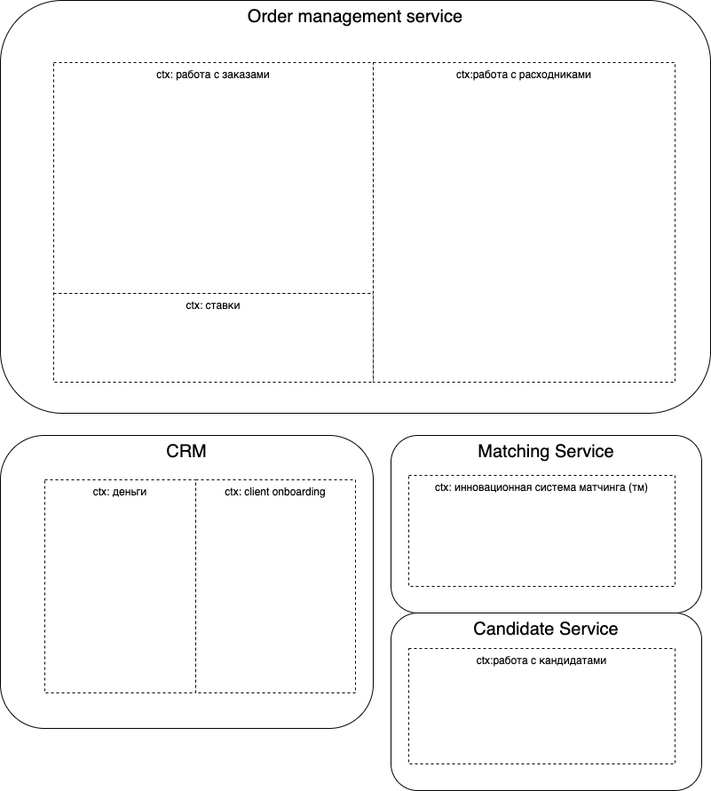

# as-2023
System analysis course

<!-- Текстом опишите логику по которой сгруппировали команды и события в контексты. -->
## Группировка команд и событий в контексты

Основная применённая логика по распределнию на контексты заключалась в следующем:

- Относится ли данная активность к основному бизнесу по оказанию услуг(прим. ставки - не основной бизнес, работа с заказами - основной)
- Существующий опыт на рынке(работа с кандидатами может быть точкой уязвимости для ддоса)
- Органзация внутри компании(менеджры работают с заказами, а сборщики занимаются расходниками)
- Повышенные требования к безопасности и аудиту(деньги)
- Повышенные требования к итерациями(инновационная система матчинга и client onboarding)
<!-- 
Выберите подходящую реализацию проекта (монолит или сервисы, как элементы системы связаны между собой).
Текстом опишите, почему была выбрана именно такая структура, какие варианты рассматривались и по каким причинам было выбрано итоговое решение.
Если были выбраны сервисы — текстом опишите, почему были выбраны синхронные или асинхронные коммуникации. -->

## Реализация проекта
### Требования:
- низкий ТТМ, небольшая нагрузка из воркеров и менеджеров, быстрое изменение параметров отсева котов
Свои требования:
- нагрузка из кандидатов не должна влиять на основные сервисы
- сложность
- цена

### Сравнение вариантов
1) Микросервисы

Каждый контекст выделен в свой микросервис со своей базой данных

2) Монолит

Вся система в одном сервисе с большой базой данных

3) Несколько сервисов

Укрупнённый вариант по сравнению с микросервисами. Несколько контекстов объединены, а критические и рискованные контексты выделены в отдельные сервисы.
- Работа с заказами + client onboarding + ставки + работа с расходниками
- Работа с кандидатами
- Деньги
- Инновационная система матчинга

|Требование|Микросервисы|Монолит|Несколько сервисов|
|---|---|---|---|
|Низкий ТТМ|каждый контекст отделён, теоретически - ттм будет низкий|при правильном разбиении на модули и выбранных технологий с live reload, высокий ттм возможен, но потребуются очень дорогие инженеры и архитекторы|несколько отдельных сервисов не будут мешать друг другу при деплойменте, система матчинга и фильтрования живут сами по себе|
|Основная нагрузка|появляются накладные расходы на коммуникацию, но при заявленной нагрузке проблем нет|проблем не должно возникнуть при заявленной нагрузке, но существует риск, что неоптимизированный процесс матчинга повесит всю систему|Проблем не ожидается, каждый сервис может быть запущен на своём сервере|
|Отсев котов|работа с кандидатами в отдельном сервисе позволит легко менять параметры отбора, деплойменты не повлияют на основную работу, возможно отсев стоит выделить в свой микросервис|то же самое что и с низким ТТМом - возможно, но потребуется сложная архитектура с live reload, и люди, умеющие с ним работать|Ожидаются небольшие перебои в работе с кандатами при обновлении правил отсева, если они не сохранены в базе данных|
|Потенциальный ддос|работа с кандидатами в отдельном сервисе защитит основной сервис и бизнес от ддоса|При ддосе основной бизнес компании может пострадать|работа с кандидатами в отдельном сервисе защитит основной сервис и бизнес от ддоса|

### Реализация

Выбранная архитектура - **НЕСКОЛЬКО СЕРВИСОВ**

Это хороший баланс микросервисами и монолитом, т.к. 
1) меньше времени будет тратится на налаживание коммуникаций между множеством сервисами(API)
2) критические компоненты(деньги, работа с заказами) отделены от высокорискованных сервисов(работа с кандидатами, система матчинга)
3) Отдельные сервисы можно задеплоить на разного размера виртуалки