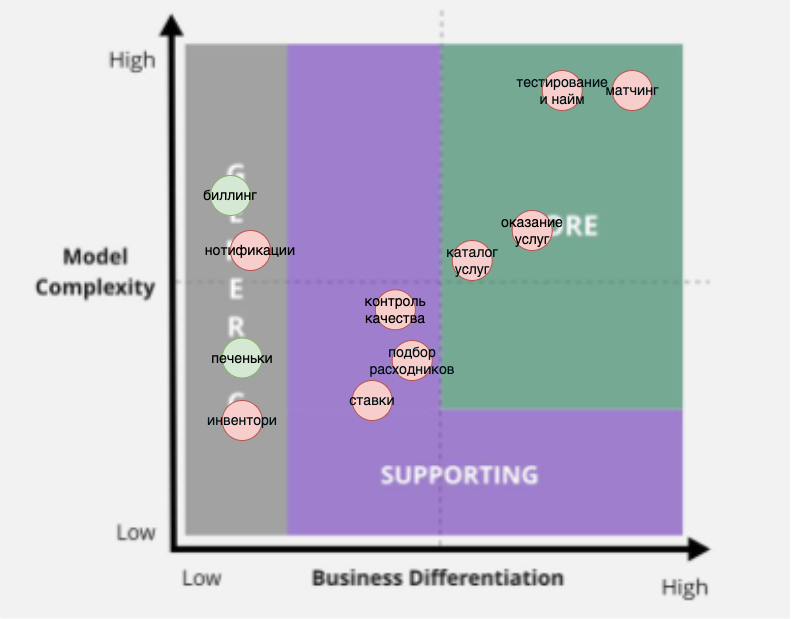
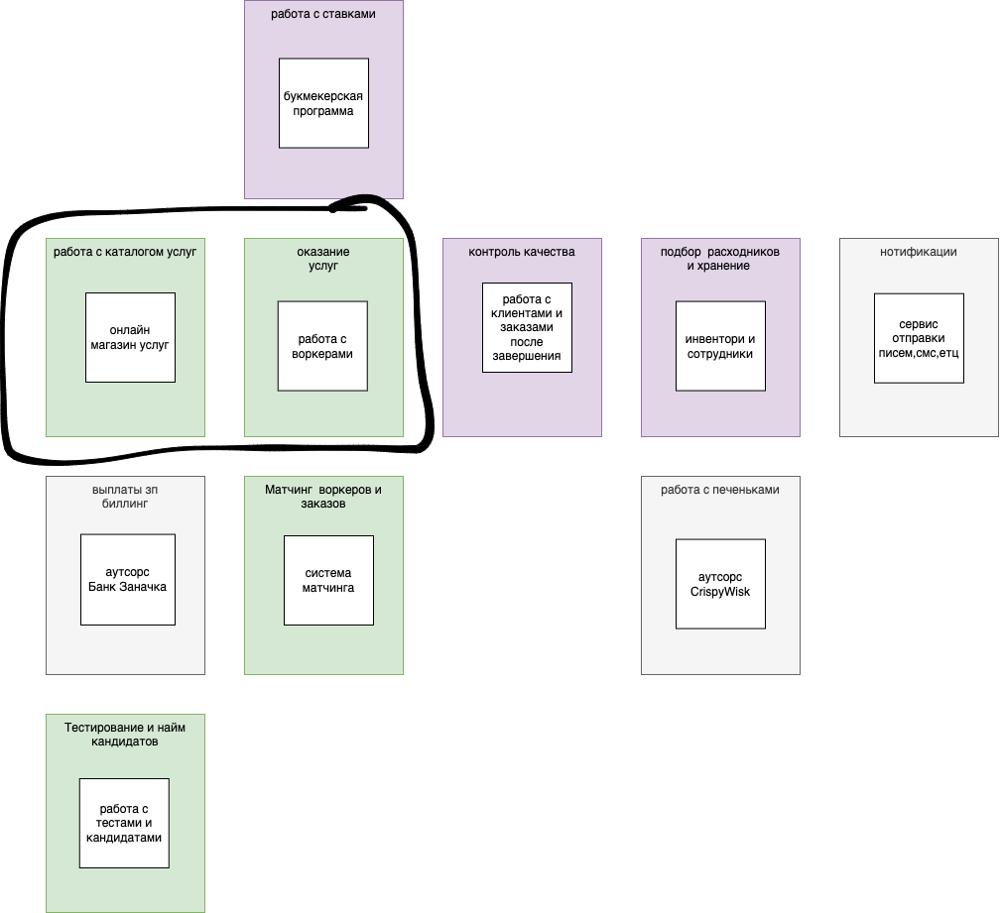
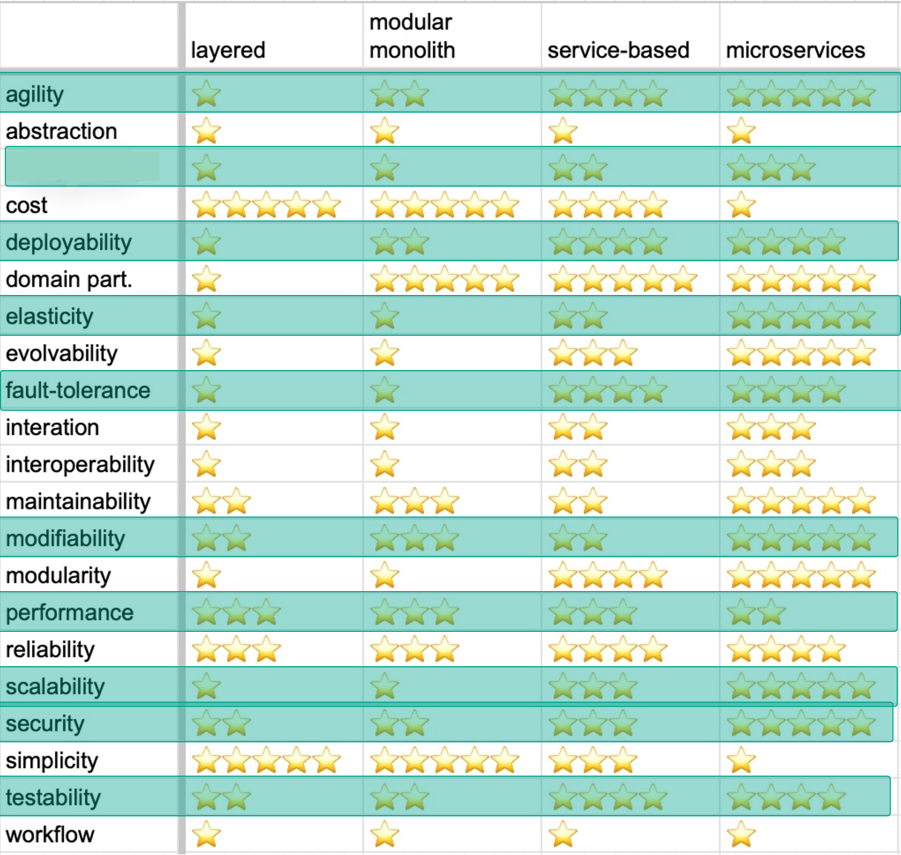

# as-2023
System analysis course

## Домашнее задание 1
### Subdomains and subdomain chart

### Compare es & ddd
Схема получилась очень похожей на оригинальную схему из event storming. В данной, контекст работы с заказами разбит на 2 поддомена

### Architecture characteristics
<!-- выпишите характеристики, важные для проекта. В нашем случае мы не можем спросить у бизнеса, что важно, а что нет;
для каждой найденной характеристики укажите место, где она была взята; -->

1. agility, testability и deployability - взято из "Общие пожелания по системе => низкий ТТМ"
2. agility, testability, modifiability, deployability, scalability, availability и fault tolerance. - взято из US-081(1), а так же "Общиe пожелания => быстро проверять и изменять гипотезы отсева котов" (2)
3. performance, availability, fault tolerance, testability, deployability, agility и security. - взято из US-150(3), в котором руководство думало как увеличить лояльность
4. security - добавляю потому что алгоритм матчинга - наше know-how, мы не хотим что оно утекло(бережно храним workerId=Random(1, 42)), плюс мы работаем с данными клиентов(возможно, домашний адрес, информацию для биллинга), плюс мы не хотим чтобы наша база данных Лучших Котов утекла к конкурентам(а так же их финансовые данные) (4)

Финальный список:
* agility
* availability
* -cost
* deployability
* fault tolerance 
* modifiability
* performance
* scalability
* security
* testability

### Pick your poison
<!-- 
выберите один из четырёх архитектурных стилей, описанных в уроке. Опишите, почему вы сделали такой выбор и по каким характеристикам сравнивали стили (можно использовать картинку из урока со сравнением стилей); -->

Ввиду того, что денег, говорят, дадут сколько потребуется, команду наберут такую, какую надо по требованиям архитектуры, выбор арзитектуры очень сильно упрощается.

Нам подходят больше всего **распределённая архитектура**, а именно **микросервисы**. 

Микросервисы имеют отличную agility, deployability, scalability & fault tolerance, что позволит не упать всей системе под наплывом "кандидатов". "Неограниченный" бюджет покроет накладные расходы на инфраструктуру(CI/CD,мониторинг), а набор новой команды позволит подобрать людей, которые знают и смогут поддерживать Ci/CD культуру, организовать эффективную коммуникацию между сервисами и поддерживать этот не самый просто архитектурный стиль.

----------
(1) [US-081]: Мы ожидаем 1к заявок в день от рандомных котов, также, судя по отзывам, наши конкуренты могут попытаться нас заддосить в этом месте. Они так делали уже несколько раз с другими компаниями, после чего компании закрывались с позором

(2) Для бизнеса критично проверять новые гипотезы по отсеву котов и изменять уже существующие с максимальной скоростью и надёжностью

(3) [US-150] Думая о том, что ещё добавить для увеличения лояльности клиентов, топ-менеджмент решил воспользоваться LLM-based catGPT-4, который подсказал 

(4) [US-060] Исследователи MCF пока думают о том, как должна работать инновационная система матчинга (тм).