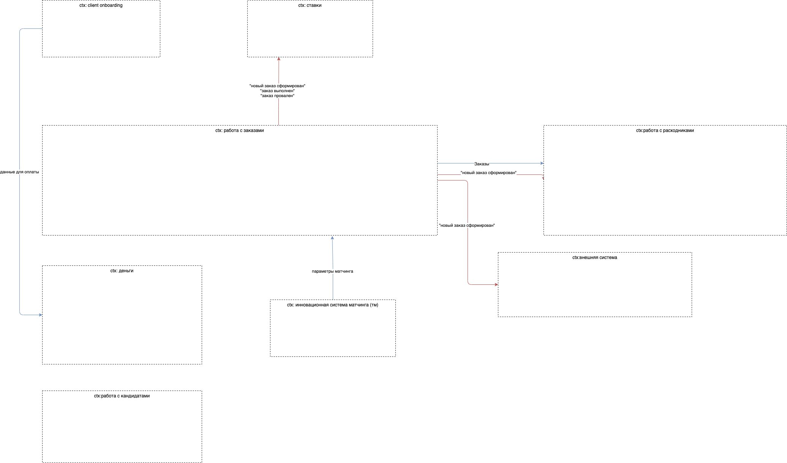

# as-2023
System analysis course

## Домашнее задание 1
### Subdomains and subdomain chart

### Compare es & ddd
Схема получилась очень похожей на оригинальную схему из event storming. В данной, контекст работы с заказами разбит на 2 поддомена

### Commuications

### Description
Описание - [AS2023-0.md](./Description.md)

