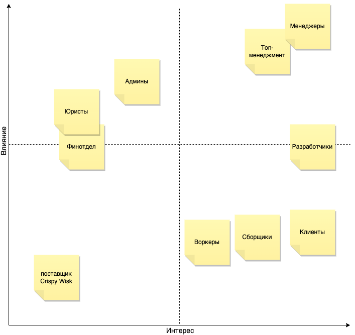
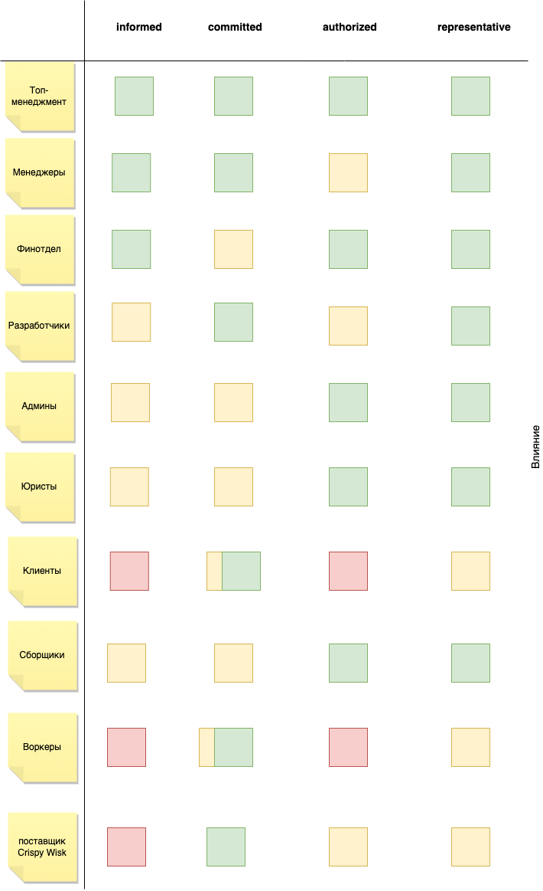
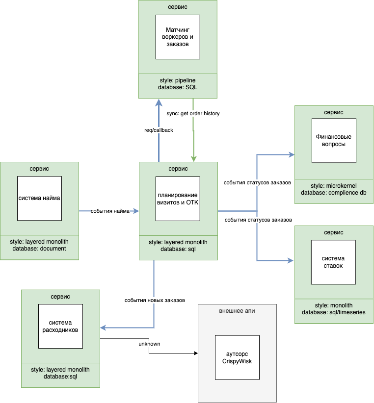

# as-2023
System analysis course

## Домашнее задание 3
### Группы стейкхолдеров

Я включил в анализ ещё воркеров, сборщиков. Воркеры и сборщики будет тесно работать с системой, они заинтересованы, но у них нет большого влияния, т.к. нет требования сделать лучший UI для этих групп. А лояльность клиентов будем зарабатывать за счёт наших алгоритмов и печеньками.

С представителями немного сложно, для воркеров и клиентов:
- Клиенты: пока что внутренние сотрудники, а них может быть байес.
- Воркеры: их нет пока, нужны эксперты с рынка.

Фирма с печеньками тоже здесь как наш будущий аутсорсер, с ним неплохо держать контакт - вдруг интерфейс заказа песенек не будет готов, или он вдруг поменяется, а для нас это одна из главных целей - повышать лояльность клиентов.

Топов можно и левее подвинуть т.к. они вникают в детали проекта.

### Архитектурный стиль
В целом - микросервисы: 
- сервис Найма
- сервис Финансовых вопросов
- сервис Матчинга заказов и воркеров
- сервис Ставок
- сервис Планирования визитов
- сервис Расходников

Микросервисы подходят лучше всего, т.к. у отдельных частей системы свои релизные циклы, внешние ограничения, внутреняя архитектура и требования по масштабированию. EDA не подойдёт, т.к. в целом, архитектура эквивалентна, но разработчики и админы хотят понимать что где упало, да и мониторинг проще.

|Сервис|Архитектура сервиса|Почему отдельно| 
|---|---|---|
|Найм|layered monolith|возможность скалировать отдельно для достижения высокого параметра scalability всей системы|
|Финансовый|microkernel, потенциальные несколько платёжных сервисов|внешние ограничению по комплаенсу|
|Матчинг|pipeline, лучше всего подходит для пошагового алгоритма подбора|самая часто изменяемая часть системы|
|Ставки|layered monolith|Выделить отдельно, чтобы не смущать никого|
|Планирование визитов|layered monolith|Основной сервис,скалируем отдельно, поды падают раздельно, повышаем fault-tolerancy всей системы|
|Расходники и ОТК|modular monolith, т.к. совмещает несколько поддоменов||

### Выбор БД

|Сервис|БД|
|---|---|
|Найм|Document, для лучшей масштабируемости, часто меняющимся требованиям по тестам|
|Финансовый|скорей всего SQL, но надо смотреть требования комплаенса|
|Матчинг|Document т.к. набор параметров для матчинга может меняться, а матчинг обогощается данными из ОТК в пайплайне на лету|
|Ставки|на усмотрение разработчиков, простой реляционной БД хватит|
|Планирование визитов|простой реляционной БД хватит|
|Расходники и ОТК|простой реляционной БД хватит|

### Коммуникации

В основном коммуникации получились асинхронные, через эвенты. 
Сервис найма транслирует эвенты с нанятыми сотрудниками, которые попадают, и в систему матчинга, и в планирование визитов.
Сервис визитов транслирует события с заказами, на их основе финансовый сервис получает необходимые данные для работы, система ставок может анонимно слушать результаты заказов, сервис расходников тоже асинхронно реагирует на события с новыми заказами.
Между сервисом визитов и матчингом request-callback коммуникация, т.к. запрос в матчинг имеет не только параметры заказа, но и эталонный образец. Информация про эталонный образец не нужен в событиях. 
Для обогащения запроса дополнительными историческими данными у нас появляется синхронный интерфейс от сервиса матчинга к сервису визитов.

