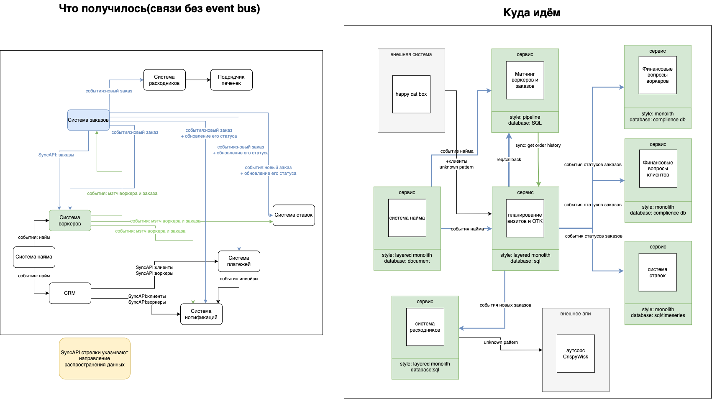
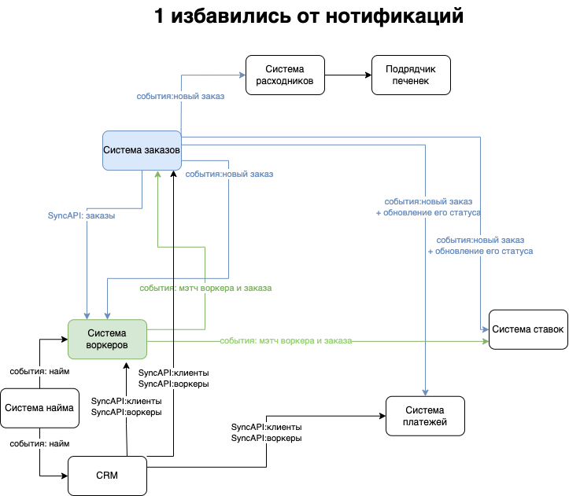
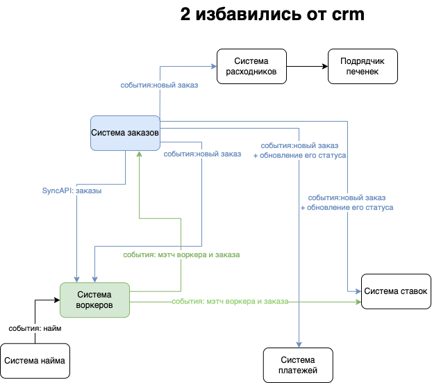

# as-2023
System analysis course

## Домашнее задание 4

### 0. Оценить масштаб трагедии(домашка 0 => 3)

#### План:
1) Избавиться от сервиса нотификаций
2) Избавиться от CRM(workers&clients entity service)

### 1. Для каждого сервиса который добавится или удалится и связанных с ним сервисов посчитайте значение instability;

####  1.1 Избавляемся от нотификаций

- instability(нотиф.) = 0/(0 + 4) = 0
- instability(ворк) = 1/(1 + 0) = 1
- instability(заказы) = 1/(1 + 0) = 1
- instability(crm) = 1/(1 + 0) = 1

####  1.2 Избавляемся от CRM

- instability(CRM) = 3/(3 + 1) = 0.75
- instability(найм) = 0/(0 + 1) = 0
- instability(заказы) = 0/(0 + 1) = 0
- instability(воркеры) = 0/(0 + 1) = 0

### 2. Oпишите, какие сервисы и боундед-контексты в каком месте и каким образом будут меняться;

- Notification service: Получается, по аналогии с уроком, когда удалили сервис нотификации, в bounded contexts сервисов воркеров, заказов и CRM добавился технический шаг нотификаций.

- CRM Service: Когда удалили CRM(entity service воркеров и клиентов), сервиса заказов стал мастером данных клиентов и воркеров, и данные могут стримится асинхронно в систему ставок, воркеров и платежей

### 3. Cпланируйте, как и в какой последовательности будет происходить работа. Сделайте два описания, для каждого из условий:

- когда свободных людей и ресурсов нет, а опыт и (или) инфраструктура есть
tbd

- когда есть свободные люди и ресурсы, а опыта и (или) инфраструктуры нет
tbd